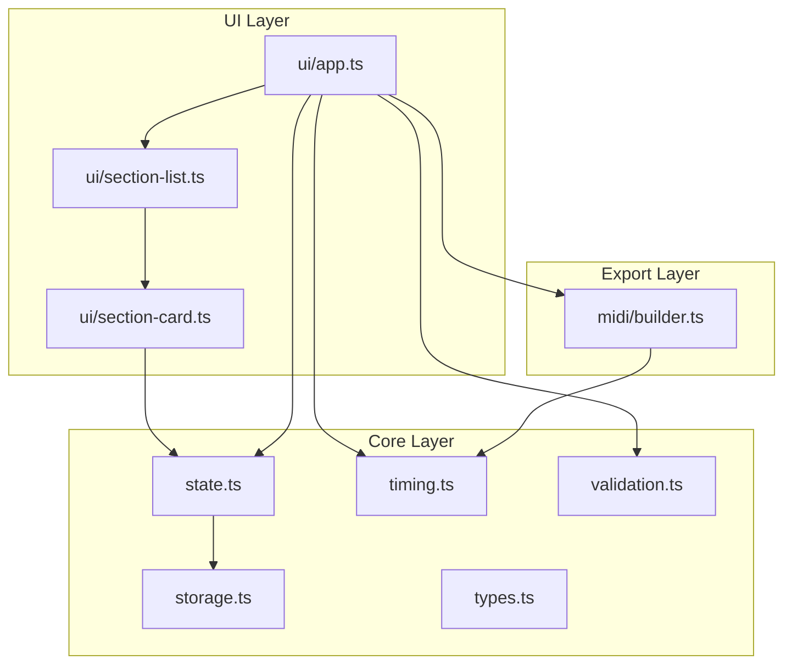

# Architecture

Technical overview for developers and future AI sessions.

## High-Level Flow



## Directory Layout

```
src/
├── main.ts              # Entry point
├── types.ts             # Section, AppState, constants
├── state.ts             # CRUD + reorder + pub/sub
├── storage.ts           # localStorage read/write
├── timing.ts            # Duration and tick calculations
├── validation.ts        # Section field validation
├── midi/
│   └── builder.ts       # MIDI encoding + download trigger
├── ui/
│   ├── app.ts           # Shell layout, summary, actions
│   ├── section-list.ts  # List container + drag-and-drop
│   └── section-card.ts  # Per-section form card
└── styles/
    └── main.css         # All styles
```

## State Model

```typescript
interface Section {
  id: string;
  label?: string;
  numerator: number;       // 1–12
  denominator: 2|4|8|16;
  tempo: number;           // 40–240 BPM
  bars: number;            // >= 1
}

interface AppState {
  sections: Section[];
}
```

### State Lifecycle

1. On load: `storage.ts` reads `localStorage` → `state.ts` initializes `sections`
2. On mutation: `state.ts` updates in-memory array, calls `saveState()`, notifies subscribers
3. `ui/app.ts` subscribes and re-renders section list + summary on every mutation

## Timing Calculations

Quarter-note beats per bar:

```
beatsPerBar = numerator × (4 / denominator)
```

Section duration in seconds:

```
seconds = bars × beatsPerBar × (60 / tempo)
```

Section length in MIDI ticks (PPQ = 480):

```
ticks = bars × beatsPerBar × 480
```

## MIDI Generation

See [MIDI_FORMAT.md](./MIDI_FORMAT.md) for byte-level detail.

Summary:

- Type 0 file, one track, PPQ 480
- For each section at its start tick: emit Set Tempo, then Time Signature (delta 0 between them)
- Delta to first event of section N (N > 0) = tick length of section N−1
- End with End of Track meta event (`FF 2F 00`)

## UI Rendering Strategy

- **Full re-render** of section list on state change (acceptable at v1 scale)
- Section label saves on `blur` to avoid re-render during typing
- Number/select fields save on `change`
- Download button `disabled` when `sections.length === 0` or any section is invalid

## Build & Runtime

| Concern | Detail |
|---------|--------|
| Dev server | `pnpm dev` — Vite, base path applied |
| Production build | `pnpm build` → `dist/` |
| Preview | `pnpm preview` |
| Tests | `pnpm test` — Vitest, node environment |
| Browser APIs used | `localStorage`, `crypto.randomUUID()`, `Blob`, `URL.createObjectURL` |

## Extension Points

| Feature | Touch points |
|---------|--------------|
| JSON import/export | `storage.ts`, new button in `ui/app.ts` |
| Marker meta events | `midi/builder.ts` |
| Key signatures | `types.ts`, `section-card.ts`, `midi/builder.ts` |
| Undo/redo | `state.ts` history stack |
| Smarter DOM updates | Replace full re-render in `ui/app.ts` |